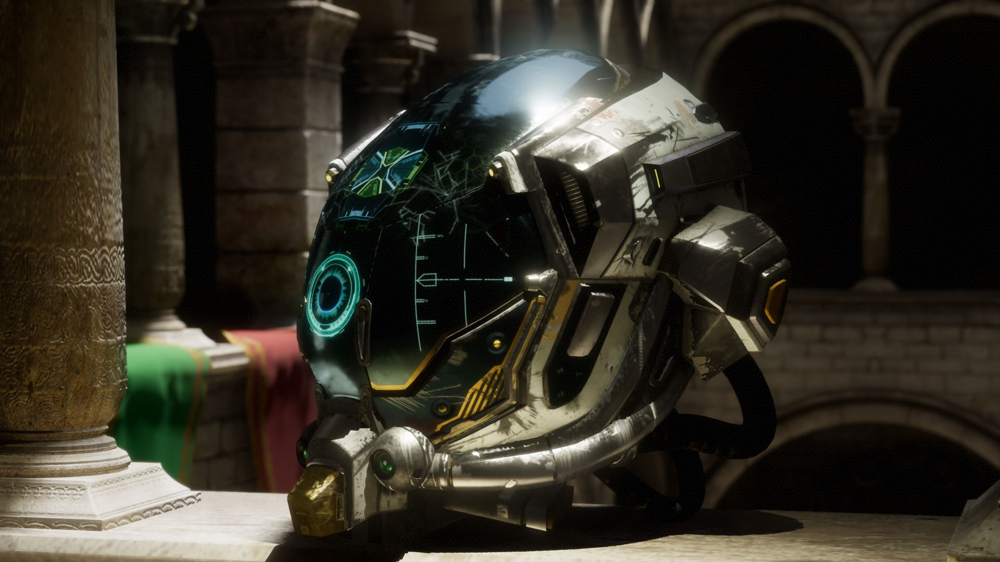

<div align="center">
   <h1>Arkose Renderer</h1>
   <h3><i>A flexible rendering engine for real-time graphics R&D</i></h3>
</div>


*Arkose Renderer* attempts to make it as simple as possible for you to write complex & robust graphics features while still keeping it expressive enough to allow you to do graphics R&D.

It supports multiple rendering backends and abstracts the specifics with a coarse granularity (i.e. not 1:1 with APIs) which focuses more on logical groupings than hardware specifics, while staying performant. It is based on modern rendering APIs and heavily relies on features such as bindless textures and ray tracing.

Arkose Renderer is very much a rendering engine and *not* a game engine, but I have some ambition to over time make it into more of a general purpose system with physics, audio, and gameplay scripting.


</img>
</img>
</img>

## Incomplete list of features

This list is not complete, it's just a showcase of various features that are implemented, presented in no significant order.

### Engine features

 - Async asset loading (for some resource types)
 - Custom asset system for all common asset types
 - Offline image block compression (BC5 & BC7)
 - Simple animation engine for e.g. skeletal meshes
 - Custom task graph implementation (work/job system)
 - Shader hot-reloading with support for `#include`s
 - Suite of editor tools, gizmos, and debug rendering
 - Tight integration with CPU & GPU profiling tools
 - Physics (work-in-progress)

### Rendering features & techniques

 - Real-time ray tracing
 - Bindless texture support
 - Skeletal mesh skinning and rendering
 - Meshlet based visibility buffer rendering with meshlet culling (using mesh shaders)
 - GPU driven rendering, with object-level culling (still supported as part of the old path, but visibility buffer is now the main rendering path)
 - A realistic camera model, with focus and exposure controls that will be familiar to photographers
 - Depth of field, respecting the realistic camera model paramer such as aperture size and focal length
 - Dynamic Diffuse Global Illumination (DDGI) – a probe based global illumination solution with infinite light bounces.
 - Built-in support for baking AO & bent normals
 - Physically based subsurface scattering
 - Ray traced reflections with denoising
 - Temporal Anti-Aliasing (TAA)
 - DLSS 3 integration

 > **DISCLAIMER:** There is still a long list of features to add, many of them quite basic. The philosophy with this project has always been to work on whatever I feel like at that point in time, so there is no real concept of natural order here or minimum viable product. We're not in production after all :^) Some of these obvious basic features that I can think of right now are: light culling to make the rendering tiled or clustered and proper support for transparent objects.


## Repository structure

```
Arkose
|-- arkcore         # all reusable arkose code
|   |-- asset       # asset types, serialization, and importing
|   |-- core        # various core features: maths, task graph, etc.
|   |-- physics     # physics definitions
|   |-- rendering   # rendering definitions
|   `-- scene       # scene definitions
|-- arkose          # all arkose engine & runtime code
|   | main.cpp      # application entry point (for most platforms)
|   |-- application # everything related to application startup, main loop, and shutdown
|   |   `-- apps    # apps, e.g. a game or a graphics showcase
|   |-- physics     # root for physics code
|   |-- rendering   # root for rendering code
|   |   |-- backend # rendering backend code (RHI) for interfacing with graphics APIs
|   |   `-- nodes   # rendering techniques and features (API agnostic)
|   |-- scene       # scene representation, e.g. scene, camera, lights
|   |-- shaders     # all shader code used by arkose in run-time
|   `-- system      # system (platform) specifics
|-- assets          # all assets used by the engine & apps
`-- deps            # root for in-tree code dependencies
```

Note that some details are omitted for brevity.

## Prerequisites

### Hardware
 - You will need a fairly modern GPU (e.g., ray tracing support is strongly recommended)

### Software
 - A C++ 20 compiler (or later)
 - CMake 3.7 (or later)
 - The Vulkan SDK (see https://vulkan.lunarg.com/). This applies even if you don't intend on using the Vulkan graphics backend, as some tools and libraries we rely on are part of the SDK. *Make sure to include shader toolchain debug symbols if you intend on making Debug builds!*
 - For Windows/MSVC, Windows 10 SDK version 2104 (10.0.20348.0) or later, as previous versions don't work well with `/Zc:preprocessor` which we use ([more info](https://developercommunity.visualstudio.com/t/stdc17-generates-warning-compiling-windowsh/1249671))

 > **DISCLAIMER:** Not much about Arkose is platform specific but it has mostly been compiled and run by myself on Windows and with MSVC. Most other platforms and compilers *should* work but no guarantees.

## Setup

Here are some simple steps to get it compiling & running for you:

 1. Download (or clone) this repository
 1. Run the `GenerateProjectFiles` script (`.bat` for Windows or `.sh` for Linux/macOS/etc.)
 1. Project files should now be generated under `build/` – build the project as you'd usually do
 1. When running ensure the working directory is the one containing the executable (for the Visual Studio generator this should be done for you!)

All the GenerateProjectFiles script does is run CMake and generate project files into `build/` for the default generator. However, you can of course also run CMake manually if you wish.

Note that all third-party dependencies (besides the Vulkan SDK) are either in-tree or dowloaded by CMake automatically via [FetchContent](https://cmake.org/cmake/help/latest/module/FetchContent.html) during configure. Due to this CMake will take a few minutes to configure the project the first time around. Similarly, and for the same reason, the first build will also be slower.


### Tools setup

 > **Work in progress!** Not much point in looking here yet.

The entire tools stack depends on [OpenUSD](https://github.com/PixarAnimationStudios/OpenUSD) and is needed for compilation. Note that this dependency only exists for the offline tooling so it's not needed for anything runtime, e.g. renderer/game.

To be able to build any of the tools, first install OpenUSD. Nowadays it's not too difficult to build USD yourself, so I'd recommend that. There is also the option to [download the pre-built libraries and tools provided by Nvidia](https://developer.nvidia.com/usd#libraries-and-tools), but I've never had any success with it for Windows.

For CMake to find USD, ensure that `PXR_USD_LOCATION` is defined (either as a CMake variable or as an environment variable), and pointing at the root directory of where you installed it. If setup correctly, CMake should pick up on this and build tools accordingly.

## License

This project is licenced under the [MIT License](https://choosealicense.com/licenses/mit/). See the file `LICENSE` for more information. Third-party dependencies (in `deps/`) and third-party assets (in `assets/`) are potentially licensed under other terms. See their respective directories & files for additional information. Some individual files and functions may also be licensed separately and are marked as such in or near the relevant files.
